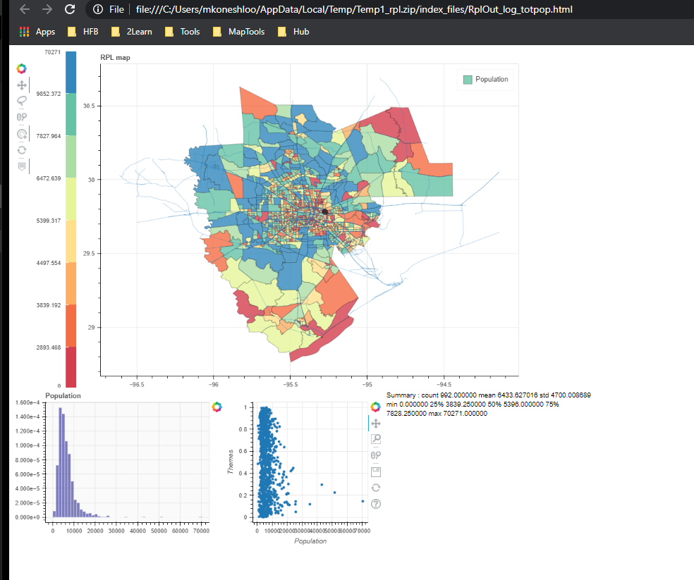

-Dveloped by: Mo Koneshloo for HFB-
-Contact: mkoneshloo-at-gmail-dot-com-

# MapTX
This repository contains the code and some example data to generate a map visualization of data. It can be used to visualize any quantitive variable as a series of polygon on map. To this aim two components are requiered:

1-Appropriate file of the geometry: a GeoJson file continin a GEOID key (it can be zip code, county subdivision code, county code, ....)
2- Dataset with the mesured value on each polygone and the same GEOID key  
## bokeh_mapper.py
This script reads these two file, preprocess and merge them to generate Bokeh's input. 
Bokeh provoides a set of flexible tools to interact with visulized map, which is generated as an HTML file by the code. 
All setings come from a json file, explined in the next section. The only parameter of the code is the address to this json file.
It is hardcoded for now.

## Parameters:
At this step, code reads the parameter from a json file, described below. 
The list of parameter consists of several parts; input, visual, and output parameters

### Input Parmeters:
* Source to read polygons' boundry
"shapeFile":"../data/TractPolygon.geojson",
* source to read file from an Url address:
"shapeUrl":"None",
* Source to read data set, in the future version these can be replaced with result of a SQL query
"dataFile":"../data/TractData.csv",
* Subset fields of the geometry file to reduce the file volume/remove unnecessery data, dict format
"shapeFields":{
	"s1":"GEOID",
	"s2":"geometry"
	},
* Link key from geometry file
"shapeKey":"GEOID",
* Subset fields of the dataset to reduce the file volume/remove unnecessery data, dict format
"dataFields":{
	"d1":"County",
	"d2":"GEOID",
	"d3":"Area",
	"d4":"Population"
	},
* Link key from geometry file
"dataKey":"GEOID",
* Main parameter to be used as color scale
"data2Viz":"Population",

### Visual setting
* Proper presentation of variable name on map
"dataName2Vize":"Census estimated population",
* Colormap
"cMapName": "YlGnBu",
* Number of color (not in use yet)
"cNumber" : "32",
* Using reversed color pallet
"reversedColorMap" : "False",
* Map title
"figTitle" : "Census Data Map",
* TipTools shows the GEOID and main parameter when you hover on each polygon, you can add a theird one, by adding Field name (starting by @), and its title to show in tiptoll
"tipTitle": "Area",
"tipName": "@Area",

### Output 
"htmlOut": "../data/TractOut.html",
}

